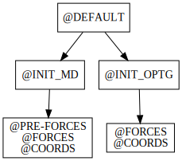

# MDI Mechanic LAMMPS report

This repo presents test results for the MDI interface implementation in the LAMMPS code.

To view the README.md offline, it is suggested that you use grip (i.e., pip install grip).

## Overview of steps

The following lists the basic steps required to run a MDI calculation.
MDI Mechanic will automatically test each of these steps and indicate whether each one is currently working or not.

[comment]: <> (Badges are downloaded from shields.io, i.e.:)
[comment]: <> (curl https://img.shields.io/badge/-working-success --output report/badges/-working-success.svg)

1.  Configure repo
2.  Build engine
3.  Add engine test(s)
4.  Implement minimalistic engine functionality
5.  Error on unsupported commands
6.  Continue to add support for more MDI commands

## Nodes

The graph indicates which nodes have been implemented in this engine and the connections between them.

## Commands

The following table indicates which MDI Standard commands are supported by this engine at each node.
Supported commands are indicated in green, while unsupported commands are indicated in gray.

[travis]: <> ( supported_commands )
## Supported Commands

| | @DEFAULT | @INIT_MD | @INIT_OPTG | @PRE-FORCES | @FORCES | @COORDS |
| ------------- | ------------- | ------------- | ------------- | ------------- | ------------- | ------------- |
| @ |  |  |  |  |  |  |
| &lt;@ |  |  |  |  |  |  |
| &lt;CELL |  |  |  |  |  |  |
| &gt;CELL |  |  |  |  |  |  |
| &lt;CELL_DISPL |  |  |  |  |  |  |
| &gt;CELL_DISPL |  |  |  |  |  |  |
| &lt;CHARGES |  |  |  |  |  |  |
| &gt;CHARGES |  |  |  |  |  |  |
| &lt;COORDS |  |  |  |  |  |  |
| &gt;COORDS |  |  |  |  |  |  |
| &lt;DIMENSIONS |  |  |  |  |  |  |
| &lt;ELEC_MULT |  |  |  |  |  |  |
| &gt;ELEC_MULT |  |  |  |  |  |  |
| &lt;ELEMENTS |  |  |  |  |  |  |
| &lt;ENERGY |  |  |  |  |  |  |
| EXIT |  |  |  |  |  |  |
| &gt;FORCES |  |  |  |  |  |  |
| &gt;+FORCES |  |  |  |  |  |  |
| &lt;FORCES |  |  |  |  |  |  |
| @INIT_MD |  |  |  |  |  |  |
| @INIT_OPTG |  |  |  |  |  |  |
| &lt;KE |  |  |  |  |  |  |
| &lt;KE_ELEC |  |  |  |  |  |  |
| &lt;KE_NUC |  |  |  |  |  |  |
| &lt;MASSES |  |  |  |  |  |  |
| &gt;MASSES |  |  |  |  |  |  |
| &lt;NAME |  |  |  |  |  |  |
| &lt;NATOMS |  |  |  |  |  |  |
| &lt;PE |  |  |  |  |  |  |
| &lt;PE_ELEC |  |  |  |  |  |  |
| &lt;PE_NUC |  |  |  |  |  |  |
| &lt;STRESS |  |  |  |  |  |  |
| &gt;STRESS |  |  |  |  |  |  |
| &lt;TOTCHARGE |  |  |  |  |  |  |
| &gt;TOTCHARGE |  |  |  |  |  |  |
| &lt;VELOCITIES |  |  |  |  |  |  |
| &gt;VELOCITIES |  |  |  |  |  |  |

## Acknowledgements

Badges are obtained from the  project.
